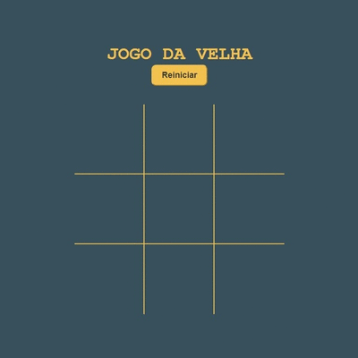
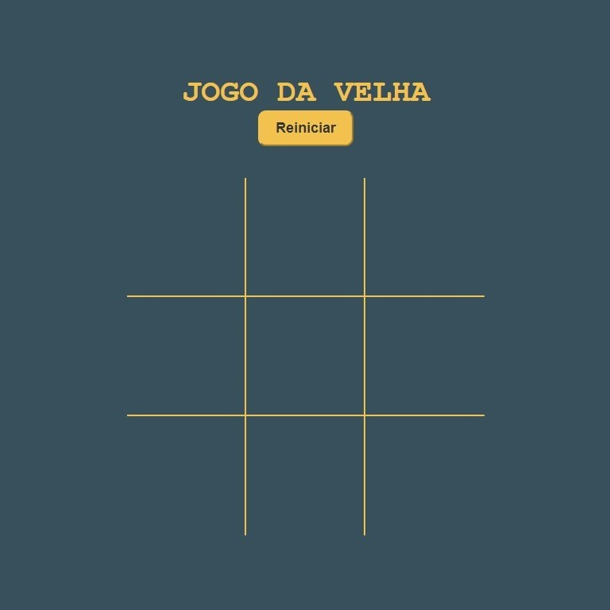
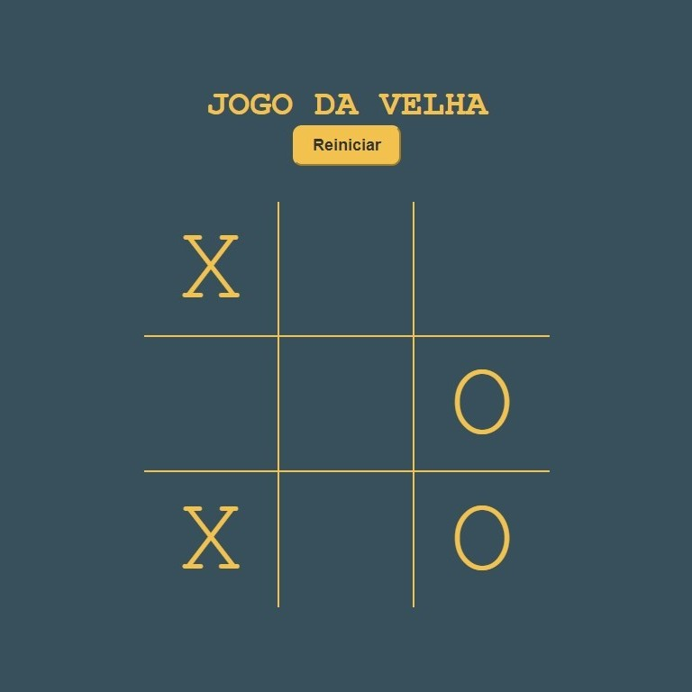
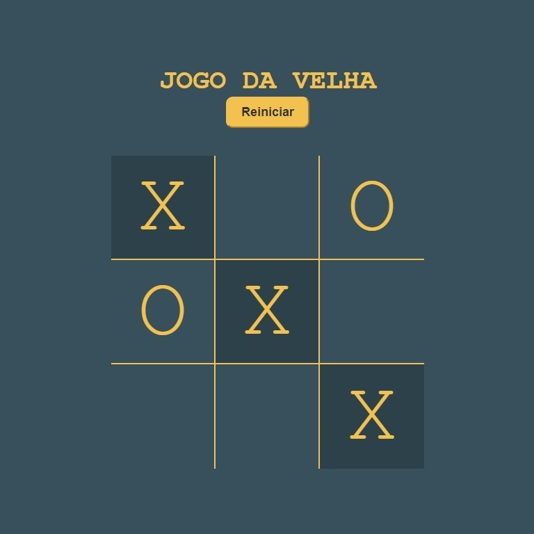

<h1>Jogo da Velha 🎮</h1>
	<i>
O Jogo da Velha é um projeto que desenvolvi para aprender as tecnologias de front-end HTML, CSS e JavaScript. O jogo é baseado no clássico jogo da velha, onde dois jogadores tentam vencer conectando três símbolos iguais em uma grade 3x3.
</i>
   
	<h2>Como jogar 🕹️</h2>
   
	<ol>
		<li>Abra o arquivo "index.html" em seu navegador web.</li>
		<li>Clique em uma célula vazia da grade para colocar seu símbolo (X ou O).</li>
		<li>O jogador que conectar três símbolos iguais em linha horizontal, vertical ou diagonal vence o jogo.</li>
	</ol>
   
  

   
	<h2>Demonstração do jogo 🎥</h2>
   
	
Confira abaixo um GIF animado mostrando o Jogo da Velha em ação:

	

   
	<h2>Acessar site 🔗</h2>
	
Você pode acessar o jogo da velha em meu portfólio, disponível em meu perfil.

	<u><a href="https://mikaelnogueira.github.io/jogo-da-velha/">Clique aqui para acessar o jogo da velha</a></u>

   
  

   
	<h2>Funcionalidades 🚀</h2>
   
	<ul>
		<li>O jogo pode ser reiniciado a qualquer momento clicando no botão "Reiniciar".</li>
		<li>A vitória será sinalizada com a alateração de cores após a combinação da sequência de elementos, seja X ou O.</li>
	</ul>
   
	<h2>Tecnologias utilizadas 💻</h2>
   
	<ul>
		<li>HTML</li>
		<li>CSS</li>
		<li>JavaScript</li>
	</ul>
   
  

   
	<h2>Screenshots 📸</h2>
   
  <h3> Tela de Inicio do Jogo:</h3>
	
   
   
  <h3>Funcionamento do Jogo:</h3>
	
   
   
  <h3>Vitória do Jogo:</h3>
  
   
   
  

   
	<h2>Autor 👨‍💻</h2>
	
Este projeto foi desenvolvido por Mikael Nogueira, como parte do portfólio de aprendizagem em front-end. Esse projeto foi baseado no desafio proposto por <a href="https://github.com/Siphiwo">@Siphiwo</a> do <a href="https://www.youtube.com/watch?v=y2Y25r94QLs"><u>Coding With Siphiwo</u></a>. Gostaria de agradece-lo por ensinar gratuitamente a desenvolver este jogo.

   
  

   
	<h2>Redes Sociais 🌐</h2>
	<ul>
		<li>Me siga no Instagram: <a href="https://www.instagram.com/nog.mikael/">@<u>nog.mikael</u></a></li>
		<li>Conecte-se comigo no LinkedIn: <a href="https://www.linkedin.com/in/mikael-nogueira-413b45274/">@<u>mikaelnogueira</u></a></li>
		<li>Veja meus projetos no GitHub: <a href="https://github.com/mikaelnogueira">@<u>mikaelnogueira</u></a></li>
	</ul>
   
  

   
	 <h2>Licença 📝</h2>
  
Este projeto está licenciado sob a licença <a href="https://opensource.org/license/mit/"><u>MIT</u></a>

   
  

   
  <h2>Divirta-se jogando! 😄</h2>

